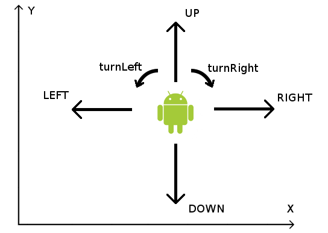

# Robot

На игровом поле находится робот. Позиция робота на поле описывается двумя целочисленным координатами: X и Y. Ось X
смотрит слева направо, ось Y — снизу вверх.

В начальный момент робот находится в некоторой позиции на поле. Также известно, куда робот смотрит: вверх, вниз, направо
или налево. Ваша задача — привести робота в заданную точку игрового поля.

Робот описывается классом Robot. Вы можете пользоваться следующими его методами (реализация вам неизвестна):

```kotlin
class Robot(var x: Int, var y: Int, var direction: Direction) {
    fun stepForward() {
        when (direction) {
            Direction.RIGHT -> x++
            Direction.LEFT -> x--
            Direction.UP -> y++
            Direction.DOWN -> y--
        }
    }
    // TODO: добавить функции turnLeft, turnRight

    override fun toString(): String {
        return "(${x}, ${y}), looks ${direction}"
    }
}
```

Direction, направление взгляда робота, — это перечисление:

```kotlin
enum class Direction {
    UP, DOWN, LEFT, RIGHT
}
```

Как это выглядит:
